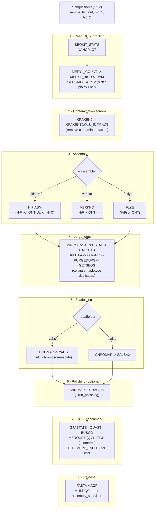
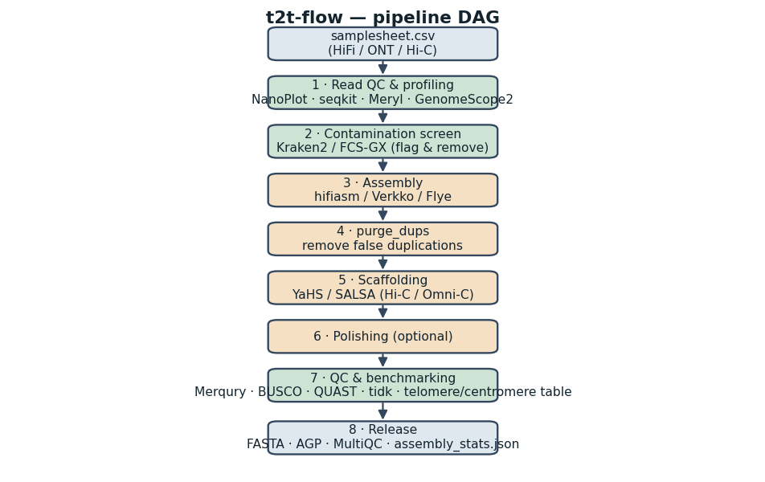
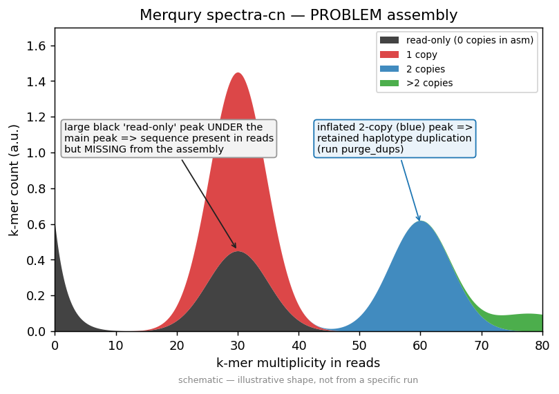
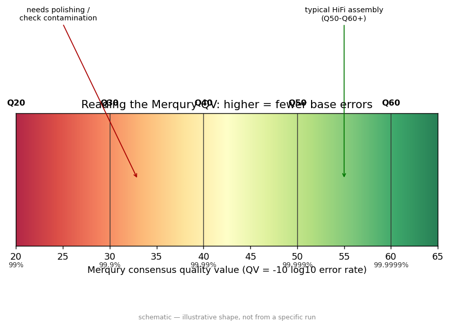
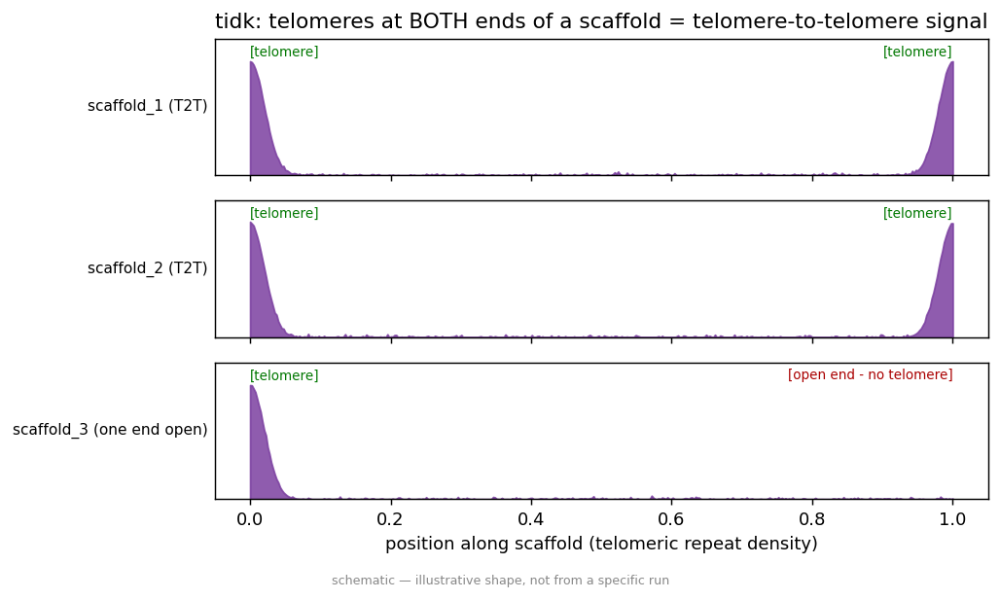

# t2t-flow

**Telomere-to-telomere de novo genome assembly of non-model organisms from long reads.**

[](https://www.nextflow.io/)
[](https://www.gnu.org/licenses/gpl-3.0)
[](https://www.docker.com/)
[](https://apptainer.org/)
[](https://docs.conda.io/)
[](.github/workflows/ci.yml)
[](https://nf-co.re/)

---

`t2t-flow` is a portable, reproducible Nextflow DSL2 pipeline that takes long reads (PacBio HiFi and/or Oxford Nanopore, optionally with Hi-C) from a **non-model organism** and produces a **telomere-to-telomere (T2T)–oriented**, quality-controlled, scaffolded genome assembly. Every step runs in a pinned container (Docker / Singularity / Conda), so the same command reproduces the same assembly on a laptop, an HPC cluster, or the cloud.

## 1. Why non-model genomes are hard

Assembling a species that has never been sequenced before is fundamentally harder than re-assembling a human or a well-studied model organism, and almost every assumption baked into "standard" pipelines breaks down. There is **no reference genome** to align against, so you cannot validate contiguity or correctness by comparison; you do not know the **genome size, ploidy, or heterozygosity** in advance, so k-mer profiling must estimate them before assembly and the assembler must cope with whatever it finds; high heterozygosity causes assemblers to emit both haplotypes as separate contigs, inflating the assembly and BUSCO duplication unless you **purge duplicates**. Non-model genomes are frequently rich in **repeats, satellite arrays, centromeres, and telomeres** that only long reads can span, and these are exactly the regions that determine whether you reach a true T2T result. Field-collected samples carry **contamination** (bacteria, viruses, host, symbionts) that must be screened out of both reads and the final assembly. Finally, there is often **no curated BUSCO lineage** close to your organism, so completeness benchmarking must fall back to a distant clade and be interpreted with care. `t2t-flow` is built around these realities rather than around the convenience of a known reference.

## 2. Pipeline architecture

The pipeline runs as eight sequential stages, several of which fan out per sample and per read type. Toggle stages on/off with `--skip_*` and `--run_*` parameters (see the [parameters reference](docs/parameters.md)).





*Figure: the eight-stage `t2t-flow` DAG (static fallback if the Mermaid diagram does not render). Reads enter at the top left; a polished, scaffolded, benchmarked FASTA plus an AGP and a MultiQC report leave at the bottom right.*

## 3. Quickstart

### 3.1 Install prerequisites

1. **Nextflow ≥ 24.04.0** (Java 17+):
   ```bash
   curl -s https://get.nextflow.io | bash
   ./nextflow -version
   ```
2. **A container engine** — pick one: [Docker](https://docs.docker.com/get-docker/), [Singularity/Apptainer](https://apptainer.org/), or [Conda](https://docs.conda.io/). Every process is containerized; you should not install bioinformatics tools on the host.

### 3.2 Quick test

**Validate the whole DAG in seconds — no containers, exactly what CI runs.** Run from the repo root (the `test` profile uses the tiny bundled fixtures in `assets/test_data/`):

```bash
nextflow run . -profile test -stub-run --outdir results
```

Every process runs as a no-op stub, so this confirms the pipeline is wired correctly end to end without pulling or installing anything.

**Run the real tools on a tiny public dataset** (pulls containers, takes a few minutes):

```bash
nextflow run . -profile test_full,docker --outdir results
```

The `test_full` profile downloads a small public PacBio HiFi read set and executes the live tools (hifiasm → purge_dups → QC → release). It was validated end to end (exit 0) on a 4-core/16 GB Linux runner.

### 3.3 Run on your data

```bash
nextflow run . \
    -profile docker \
    --input samplesheet.csv \
    --outdir results \
    --assembler hifiasm \
    --scaffolder yahs \
    --busco_lineage vertebrata_odb10 \
    --telomere_motif AACCCT \
    -resume
```

See the [usage guide](docs/usage.md) for HPC submission, resuming, and troubleshooting.

## 4. Samplesheet format

The samplesheet is a CSV with a header line. One row per sample (combine all read types for a sample on a single row). Validated against [`assets/samplesheet_schema.json`](assets/samplesheet_schema.json) via nf-schema.

| Column       | Required? | Format / accepted values | Description |
|--------------|-----------|--------------------------|-------------|
| `sample`     | **Required** | string, unique, no spaces | Sample identifier; becomes `meta.id` and the prefix of every output. |
| `hifi`       | Optional* | `.fastq.gz` / `.fq.gz` (PacBio HiFi/CCS reads) | Primary long reads for `hifiasm`/`flye`; preferred profiling reads. |
| `ont`        | Optional* | `.fastq.gz` / `.fq.gz` (Nanopore reads) | Ultra-long reads; used by `verkko`, as `--ul` in `hifiasm`, or as `flye` input. |
| `hic_1`      | Optional | `.fastq.gz` (Hi-C R1) | Hi-C forward reads; required for scaffolding and for `hifiasm --h1`. |
| `hic_2`      | Optional | `.fastq.gz` (Hi-C R2) | Hi-C reverse reads; must be paired with `hic_1`. |

> **\*** At least one of `hifi` or `ont` must be present per sample. If only `ont` is supplied, choose `--assembler flye` or `--assembler verkko`. Empty optional cells are left blank (e.g. `sampleA,reads.hifi.fastq.gz,,,`).
>
> The Hi-C restriction enzyme for the SALSA2 scaffolder is set globally on the command line with `--hic_enzyme` (e.g. `--hic_enzyme GATC`), not per sample.

Example:

```csv
sample,hifi,ont,hic_1,hic_2
beetleX,/data/beetleX.hifi.fastq.gz,,/data/beetleX.hic.R1.fastq.gz,/data/beetleX.hic.R2.fastq.gz
frogY,/data/frogY.hifi.fastq.gz,/data/frogY.ont.fastq.gz,,
```

## 5. Parameters

Full reference with types and defaults lives in [`docs/parameters.md`](docs/parameters.md). Summary, grouped by stage:

### Input / output
| Param | Type | Default | Description |
|-------|------|---------|-------------|
| `--input` | path | `null` | Samplesheet CSV (required). |
| `--outdir` | path | `null` | Output directory (required). |
| `--email` | string | `null` | Email for completion notification. |
| `--multiqc_title` | string | `null` | Custom MultiQC report title. |
| `--multiqc_config` | path | `null` | Extra MultiQC YAML config. |

### Profiling
| Param | Type | Default | Description |
|-------|------|---------|-------------|
| `--kmer_size` | integer | `21` | k-mer length for Meryl / GenomeScope2 / Merqury. |
| `--ploidy` | integer | `2` | Expected ploidy for GenomeScope2. |
| `--genome_size` | string | `null` | Known/estimated genome size (e.g. `1.2g`); aids gfastats / some assemblers. |
| `--skip_readqc` | boolean | `false` | Skip stage 1 (also skips Merqury inputs). |

### Contamination
| Param | Type | Default | Description |
|-------|------|---------|-------------|
| `--skip_contamination` | boolean | `false` | Skip read-level contamination screening. |
| `--kraken2_db` | path | `null` | Kraken2 database directory; required to actually run screening. |
| `--contaminant_taxids` | string | `'2,2157,10239'` | Comma-separated taxids to remove (default: Bacteria, Archaea, Viruses). |
| `--run_fcs_gx` | boolean | `false` | Run NCBI FCS-GX assembly-level decontamination. |
| `--fcs_gx_db` | path | `null` | FCS-GX database directory. |
| `--fcs_gx_tax_id` | integer | `null` | NCBI taxid of your organism for FCS-GX. |

### Assembly
| Param | Type | Default | Description |
|-------|------|---------|-------------|
| `--assembler` | string | `'hifiasm'` | One of `hifiasm`, `verkko`, `flye`. |
| `--flye_mode` | string | `'--pacbio-hifi'` | Flye read-type flag (`--pacbio-hifi`, `--nano-hq`, …). |

### purge_dups
| Param | Type | Default | Description |
|-------|------|---------|-------------|
| `--skip_purgedups` | boolean | `false` | Skip haplotype-duplicate purging. |

### Scaffolding
| Param | Type | Default | Description |
|-------|------|---------|-------------|
| `--scaffolder` | string | `'yahs'` | One of `yahs`, `salsa`. |
| `--skip_scaffolding` | boolean | `false` | Skip Hi-C scaffolding. |
| `--hic_enzyme` | string | `null` | Restriction enzyme/preset (SALSA2). |
| `--min_contig_length` | integer | `1000` | Minimum contig length to carry into scaffolding/reporting. |

### Polishing
| Param | Type | Default | Description |
|-------|------|---------|-------------|
| `--run_polishing` | boolean | `false` | Run Racon long-read polishing (off by default). |

### QC / benchmark
| Param | Type | Default | Description |
|-------|------|---------|-------------|
| `--busco_lineage` | string | `'auto'` | BUSCO lineage (`auto` for auto-lineage, or e.g. `vertebrata_odb10`). |
| `--busco_mode` | string | `'genome'` | BUSCO mode (`genome`, `transcriptome`, `proteins`). |
| `--busco_db` | path | `null` | Local BUSCO download path (offline use). |
| `--skip_busco` | boolean | `false` | Skip BUSCO. |
| `--telomere_motif` | string | `'AACCCT'` | Telomere repeat unit for TIDK search. |
| `--tidk_clade` | string | `null` | TIDK clade preset (overrides motif if set). |

### Resources / global
| Param | Type | Default | Description |
|-------|------|---------|-------------|
| `--max_cpus` | integer | `16` | Per-process CPU cap. |
| `--max_memory` | string | `'128.GB'` | Per-process memory cap. |
| `--max_time` | string | `'240.h'` | Per-process walltime cap. |
| `--publish_dir_mode` | string | `'copy'` | How results are published (`copy`, `symlink`, `link`). |
| `--validate_params` | boolean | `true` | Validate params against the schema. |
| `--help` / `--version` | boolean | `false` | Print help / version and exit. |
| `--monochrome_logs` | boolean | `false` | Disable ANSI colors. |
| `--trace_report_suffix` | string | timestamp | Suffix for trace/timeline reports. |

## 6. Profiles

Combine profiles with commas, e.g. `-profile test_full,docker` or `-profile slurm,singularity`.

| Profile | Purpose |
|---------|---------|
| `docker` | Run every process in Docker containers. |
| `singularity` | Run with Singularity/Apptainer (pulls Galaxy depot images). |
| `conda` | Build per-process Conda environments (no container engine needed). |
| `slurm` | Submit each process as a SLURM job (combine with a container profile). |
| `lsf` | Submit each process as an LSF/`bsub` job. |
| `awsbatch` | Run on AWS Batch (combine with `docker`). |
| `test` | Tiny synthetic inputs + stub data for CI / smoke testing. |

## 7. Interpreting the QC outputs

This section is a field guide; an even deeper, decision-tree version lives in [`docs/interpretation.md`](docs/interpretation.md).

### 7.1 GenomeScope2 k-mer profile


*Caption: a GenomeScope2 linear k-mer spectrum. The x-axis is k-mer coverage, the y-axis is the number of distinct k-mers at that coverage.* **Interpretation:** a healthy diploid genome shows a small **heterozygous peak** at ~½ the coverage of a taller **homozygous peak**; the ratio of their areas gives heterozygosity, the position of the homozygous peak times coverage gives genome size, and a fat tail to the right means repeats. A single sharp peak with no half-coverage shoulder suggests a (near-)homozygous/haploid sample; a large, ragged spike near coverage 1 that GenomeScope cannot fit usually means **contamination or sequencing error**, and a poor model fit means you should not trust the size/ploidy estimate.

### 7.2 Merqury spectra-cn (copy-number spectrum)


*Caption: a GOOD Merqury spectra-cn plot.* **Interpretation:** in a good assembly the read k-mers fall almost entirely under the "1-copy" (and, for diploid, "2-copy") colored curves, the **black "read-only" area is negligible** (few k-mers in the reads are missing from the assembly → high completeness), and there is no spurious extra peak.



*Caption: a BAD Merqury spectra-cn plot.* **Interpretation:** a tall **black read-only peak** at single-copy coverage means many true k-mers are absent from the assembly (incompleteness / dropped sequence), while a **duplicated 2-copy peak** appearing where you expect 1-copy means haplotype sequence was retained twice (uncollapsed duplication) — the classic signal that you need [`purge_dups`](docs/interpretation.md#duplication).



*Caption: how Merqury derives consensus QV from assembly-only k-mers.* **Interpretation:** QV is a Phred-scaled per-base accuracy. **QV40 ≈ 99.99 %** (1 error / 10 kb), QV50 ≈ 99.999 % (1 / 100 kb). Aim for QV ≥ 40 from HiFi; a QV in the high 20s/low 30s points to residual error, contamination, or a need for polishing.

### 7.3 BUSCO completeness


*Caption: BUSCO bar charts — a clean assembly (left) versus one with high Duplicated (right).* **Interpretation:** you want **Complete (C) ≥ 90 %** with **Single-copy (S) dominating** and **Duplicated (D) low (≲ 2–3 %)**. A high **Duplicated** fraction means the same genes appear twice — almost always **uncollapsed haplotypes / over-assembly**, fixable with `purge_dups`. High **Fragmented/Missing** with low Duplicated points to incompleteness or simply a poorly matched lineage. For non-model organisms pick the **closest available `*_odb10` clade**; if none is close, use `--busco_lineage auto` and read the result as a relative, not absolute, completeness signal.

### 7.4 Contiguity (N50) and scaffolding

**Interpretation:** N50 is the contig/scaffold length at which 50 % of the assembly is in pieces that size or longer. Rough expectations: **HiFi-only** assemblies typically reach **multi-Mb contig N50**; adding **HiFi + Hi-C scaffolding** should push the **scaffold N50 to chromosome scale** (tens of Mb to whole-chromosome), and the number of scaffolds should drop toward the haploid chromosome count. If your scaffold N50 ≈ contig N50, scaffolding did not connect much — check Hi-C depth and the enzyme setting. Use QUAST/gfastats for the numbers.

### 7.5 purge_dups cutoffs


*Caption: the purge_dups read-depth histogram with automatically chosen cutoffs.* **Interpretation:** purge_dups fits a depth histogram and places **low / mid / high cutoffs** to distinguish haplotigs (≈½ depth) from the primary contigs (full depth). A clean bimodal histogram with the mid-cut between the two modes is what you want; if the histogram is unimodal the genome may already be haploid-collapsed (purging will do little), and if the auto-cutoffs land in the wrong valley you can override them and re-run.

### 7.6 TIDK telomere plot



*Caption: TIDK per-window telomere-repeat counts along each scaffold.* **Interpretation:** strong clusters of the telomere motif at **both ends** of each chromosome-scale scaffold are the hallmark of a **T2T** result; a peak at only one end means a single capped telomere, and internal peaks can indicate misjoins or interstitial telomeric repeats. Set `--telomere_motif` to your clade's repeat (default `AACCCT`).

### 7.7 Per-chromosome telomere / centromere table

The custom `telomere_table.py` step produces a TSV/JSON summarizing, per scaffold, telomere presence at each end and putative centromeric/satellite positions. **Interpretation:** rows with telomeres at **both** ends and a single central repeat array are candidate complete chromosomes; this table is the quickest way to count how many of your scaffolds are genuinely T2T.

## 8. Hardware & runtime expectations

Indicative only — actual usage scales with genome size, coverage, and heterozygosity. `hifiasm` and `verkko` are the **peak-RAM** stages.

| Stage | Small HiFi genome (~300 Mb) | Large vertebrate (~3 Gb) | Notes |
|-------|-----------------------------|--------------------------|-------|
| Read QC / profiling | 4 CPU · 16 GB · <1 h | 8 CPU · 32 GB · 1–3 h | Meryl k-mer counting is the heaviest part. |
| Contamination (Kraken2) | 8 CPU · 32–64 GB · <1 h | 16 CPU · 64–128 GB · 1–4 h | RAM ≈ Kraken2 DB size (loaded into memory). |
| **Assembly (hifiasm)** | 16 CPU · 32–64 GB · 1–4 h | 48 CPU · **240–500 GB** · 12–48 h | Peak RAM stage. |
| **Assembly (verkko)** | 16 CPU · 64 GB · 4–12 h | 64 CPU · **300–700 GB** · 1–5 days | Highest RAM; graph-based. |
| Assembly (flye) | 16 CPU · 32 GB · 2–6 h | 48 CPU · 128–256 GB · 1–3 days | Lower RAM than hifiasm/verkko. |
| purge_dups | 8 CPU · 16–32 GB · <1–2 h | 16 CPU · 64 GB · 2–6 h | Dominated by minimap2 self-alignment. |
| Scaffolding (chromap+YAHS) | 8 CPU · 32 GB · 1–3 h | 24 CPU · 64–128 GB · 4–12 h | Scales with Hi-C read count. |
| Polishing (Racon) | 8 CPU · 16 GB · <1 h | 24 CPU · 64 GB · 2–8 h | Optional. |
| QC / benchmark | 8 CPU · 16–32 GB · 1–3 h | 16 CPU · 64 GB · 3–8 h | BUSCO is the slowest sub-step. |

> Plan for **≥ 256 GB RAM** nodes for vertebrate-scale `hifiasm`/`verkko` runs. The `--max_cpus` / `--max_memory` / `--max_time` caps prevent any single process from exceeding your node.

## 9. Outputs

```
results/
├── readqc/            # seqkit stats, NanoPlot, Meryl DBs, GenomeScope2 profiles
├── contamination/     # Kraken2 reports, cleaned reads, (FCS-GX reports)
├── assembly/          # primary + haplotype FASTA/GFA, gfastats
├── purge_dups/        # purged FASTA, haplotigs, cutoffs, before/after stats
├── scaffolding/       # scaffolds FASTA + AGP, Hi-C alignments
├── polishing/         # Racon-polished FASTA (if --run_polishing)
├── qc/                # QUAST, BUSCO, Merqury QV, TIDK telomere plots, telomere table
├── release/           # final FASTA, AGP, assembly_stats.json
├── multiqc/           # multiqc_report.html, multiqc_data/
└── pipeline_info/     # execution reports, software_versions.yml
```

Every file is described in [`docs/output.md`](docs/output.md).

## 10. Citations, license & credits

- **License:** `t2t-flow` is released under the **GNU General Public License v3.0**. See [`LICENSE`](LICENSE).
- **Citations:** `t2t-flow` wraps many third-party tools (hifiasm, verkko, flye, purge_dups, YAHS, SALSA2, minimap2, chromap, Merqury/Meryl, GenomeScope2, BUSCO, QUAST, TIDK, Kraken2, NanoPlot, seqkit, MultiQC, …). Please cite each tool you use; the full list is collected in `pipeline_info/software_versions.yml` and in the per-run MultiQC report.
- **Contributing:** issues and pull requests are welcome. The pipeline follows nf-core module conventions (one process per file, dual containers, stubbed for CI). See [`docs/usage.md`](docs/usage.md) for developer setup and the stub-run CI contract.
- **Credits:** built by the `t2t-flow` collaborators for the non-model genome assembly community.

---

For deeper reading: [usage](docs/usage.md) · [outputs](docs/output.md) · [interpretation](docs/interpretation.md) · [parameters](docs/parameters.md)
