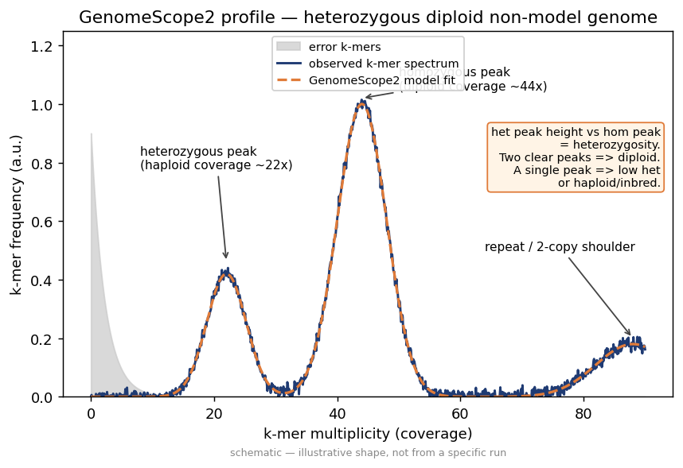
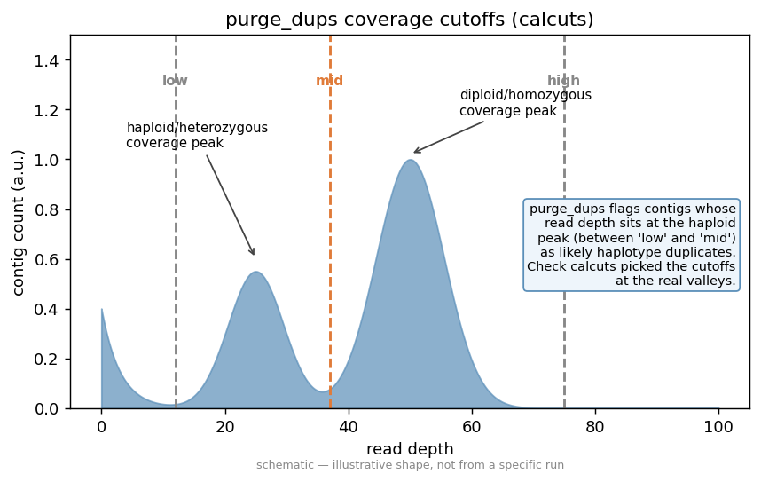
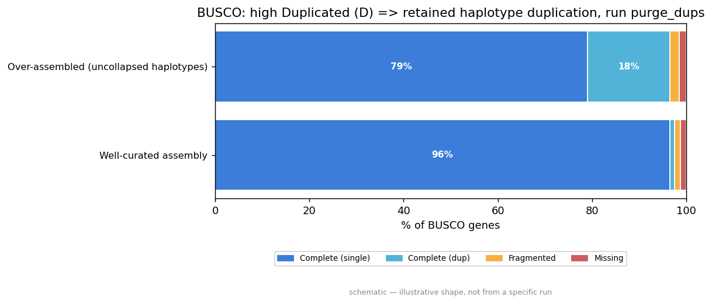
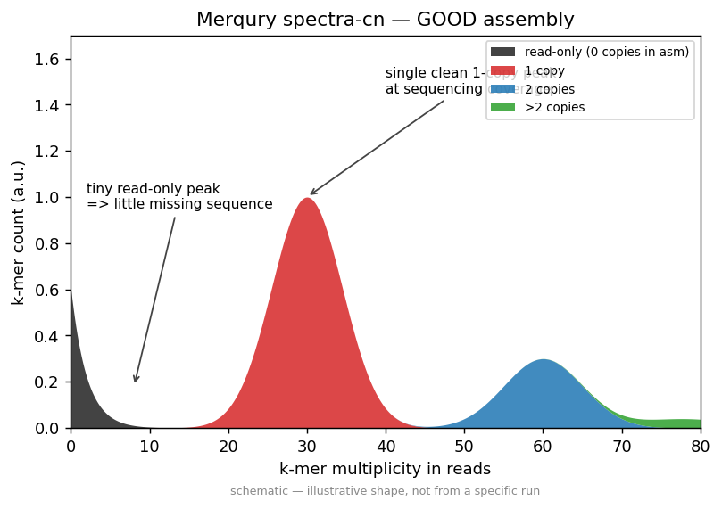

# Recipe 01 — Heterozygous eukaryote (HiFi-only → assembly → purge_dups)

**Goal.** Take PacBio HiFi reads from a *highly heterozygous, non-model* eukaryote,
build a primary contig assembly with `hifiasm`, and then use `purge_dups` to collapse
the retained haplotigs (allelic duplicates) that heterozygosity inevitably leaves in a
primary assembly. Along the way you will learn to **read the GenomeScope k-mer
profile to confirm heterozygosity**, **choose the right assembler**, and **judge a
purge_dups run by its before/after BUSCO duplication and Merqury spectra**.

---

## 1. Dataset and provenance

| | |
|---|---|
| **Organism** | *Cosmopolites sordidus* — the banana weevil, a non-model coleopteran |
| **Why this one** | It is genuinely, awkwardly **heterozygous** (a wild-caught outbred insect), so a naïve primary assembly carries visible allelic duplication — exactly the situation purge_dups exists for. |
| **Genome size** | ~0.6 Gbp |
| **Reads** | PacBio **Sequel II HiFi**, ~25.8 Gbp (~40× diploid), 1,709,178 reads |
| **Run accession** | `SRR18555109` |
| **BioProject** | `PRJNA817621` |
| **Verified source** | <https://www.ebi.ac.uk/ena/browser/view/SRR18555109> |

> **Verification note.** `SRR18555109` was confirmed against ENA at the time of
> writing: organism *Cosmopolites sordidus*, platform PacBio Sequel II, 25,813,370,147
> bases over 1,709,178 reads, status PUBLIC. The walk-through below references a
> *higher-ploidy contrast* — the autotetraploid **wax apple** (*Syzygium
> samarangense*, BioProject `PRJNA928838`) — only as a teaching foil; you do not need
> to download it.

---

## 2. The sample sheet

`samplesheet.csv` — one row, HiFi only. The Hi-C / ONT columns are intentionally
empty; the pipeline filters those channels away.

```csv
sample,hifi,ont,hic_1,hic_2
Csordidus,data/SRR18555109.fastq.gz,,,,
```

This maps to a meta map of `[ id: 'Csordidus' ]` and a single `ch_hifi` tuple
`( [id:Csordidus], data/SRR18555109.fastq.gz )`. With no Hi-C, `--skip_scaffolding`
is appropriate (recipe 02 is where scaffolding earns its keep).

---

## 3. The exact commands

See `commands.sh` for the runnable script. The essentials:

```bash
# 0. validate the DAG with no data and no containers (this is what CI runs)
nextflow run ../.. -profile test,docker -stub-run

# 1. fetch the verified HiFi reads (~25 GB gzipped) into ./data
bash commands.sh download
#   -> wget -c https://ftp.sra.ebi.ac.uk/vol1/fastq/SRR185/009/SRR18555109/SRR18555109_subreads.fastq.gz
#      (verified ENA filereport path; saved locally as data/SRR18555109.fastq.gz)

# 2. run for real
nextflow run ../.. \
  -profile docker \
  --input samplesheet.csv \
  --outdir results \
  --assembler hifiasm \
  --kmer_size 21 \
  --ploidy 2 \
  --busco_lineage endopterygota_odb10 \
  --busco_mode genome \
  --skip_scaffolding \
  --skip_contamination \
  -resume
```

Why these flags:

* `--assembler hifiasm` — see §5 for the reasoning.
* `--kmer_size 21` — the standard k for GenomeScope/Merqury on a sub-gigabase genome; large enough to be mostly unique, small enough to keep the histogram populated at 40× coverage.
* `--ploidy 2` — the weevil is diploid; this tells GenomeScope2 to fit a diploid model.
* `--busco_lineage endopterygota_odb10` — the holometabolous-insect ODB10 set; the right granularity for a weevil. (`--busco_lineage auto` also works but wastes time on lineage selection.)
* `--skip_scaffolding` — no Hi-C in this recipe.
* `--skip_contamination` — the reads are clean lab HiFi; turn this back on with `--kraken2_db /path/to/db` if you suspect symbiont/microbial contamination (weevils carry endosymbionts — see §8).

---

## 4. Reading the GenomeScope profile — *is this genome actually heterozygous?*

This is the **first** curation decision and it is made **before** you assemble.
`READ_QC` runs `meryl count k=21` → `meryl histogram` → `GENOMESCOPE2`. Open
`results/read_qc/genomescope2/Csordidus_summary.txt` and the linear/log plots.



*Figure: representative GenomeScope2 profile (schematic — illustrates the shape you
are looking for, not a render of this exact run).*

**How to read it:**

* **Two peaks** in the k-mer spectrum. The **left (heterozygous) peak** sits at
  roughly **½ the coverage** of the **right (homozygous) peak**. A pronounced left
  peak is the signature of **high heterozygosity** — every heterozygous site produces
  k-mers that occur in only one of the two haplotypes, so they appear at ~half the
  per-haplotype-doubled coverage. A weevil typically lands around **1–2% het**, which
  gives a clearly resolved left shoulder. *That left shoulder is your warning that the
  primary assembly will contain retained haplotigs and will need purging.*
* **`Heterozygosity`** in the summary — confirm it is well above ~0.5%. If it were a
  near-homozygous inbred line you would see essentially one peak and could often
  **skip purge_dups** entirely (`--skip_purgedups`). It is not, so we keep it on.
* **`Genome Haploid Length`** — should land near ~0.6 Gbp. Use it to sanity-check
  coverage: 25.8 Gbp / 0.6 Gbp ≈ **43× diploid**, comfortably above the 30× HiFi floor
  the VGP recommends.
* **Error tail at low multiplicity** — should fall away cleanly to the left. A fat,
  runaway error tail means too many sequencing errors / adapter dimers and argues for
  better read QC first.

> **Contrast (teaching foil).** Run the same profile on an **autotetraploid** like the
> wax apple and you would see **four** peaks at ~¼, ½, ¾, 1× spacing instead of two.
> That is the cue to set `--ploidy 4` and to expect purge_dups + manual phasing to be
> much harder. Ploidy is read *off the profile*, not assumed.

**Decision recorded:** the left peak is clear ⇒ the genome is heterozygous ⇒ proceed
with a haplotig-aware assembler **and** keep purge_dups enabled.

---

## 5. Choosing the assembler — *why hifiasm here*

`--assembler` accepts `hifiasm | verkko | flye`. For **HiFi-only** input on a
heterozygous diploid:

* **`hifiasm`** ✅ — purpose-built for HiFi, models the het/hom structure with its
  string-graph + haplotype-aware purging (`-l`), and emits a clean **primary**
  (`*.p_ctg`) plus **two haplotype** assemblies. Best contiguity and the most honest
  duplication behaviour on heterozygous HiFi. **Chosen.**
* `verkko` — superb, but it really wants **HiFi + ONT-UL** together to shine at the
  T2T level; with HiFi alone it is overkill and slower. We will reach for it in a
  future recipe that has ultralong ONT.
* `flye` — a great general long-read assembler, but on pure HiFi it is not as
  haplotype-aware as hifiasm and tends to leave more allelic duplication. Keep it for
  noisy CLR/ONT or when you explicitly want `--flye_mode`.

In t2t-flow, `HIFIASM` emits `assembly` (the primary `*.p_ctg.fasta`) plus
`hap1_fasta` / `hap2_fasta`. The **primary** is what flows into purge_dups.

---

## 6. purge_dups — *the heart of this recipe*

The `PURGE_DUPS` subworkflow runs, in order:

1. `MINIMAP2_ALIGN` reads → primary asm (`map-hifi`) → `*.paf`
2. `PURGEDUPS_PBCSTAT` → `PB.stat`, `PB.base.cov`
3. `PURGEDUPS_CALCUTS` → `*.cutoffs`  ← **the cut-offs you must inspect**
4. `PURGEDUPS_SPLITFA` (asm) → self-vs-self `MINIMAP2_ALIGN` (`asm5`)
5. `PURGEDUPS_PURGEDUPS` (basecov + cutoffs + self.paf) → `*.dups.bed`
6. `PURGEDUPS_GETSEQS` (asm + bed) → `*.purged.fa` (primary) + `*.hap.fa` (haplotigs)
7. `GFASTATS` before and after, for the report.

### 6a. Reading the cut-offs

Open `results/purge_dups/.../Csordidus.cutoffs` and the read-depth histogram.



*Figure: representative purge_dups cut-offs (schematic). The dashed lines are the
low / mid / high depth thresholds purge_dups picked.*

`calcuts` emits five values; the ones that matter are the **low**, **mid (the
haploid/diploid boundary)**, and **high** cut-offs:

* On a clean heterozygous HiFi histogram you expect **two humps**: a tall **diploid
  (homozygous) peak** at full depth and a shorter **haploid (heterozygous) peak** at
  ~half depth.
* The **mid cut-off should fall in the valley between the two humps.** Everything to
  the *left* of mid (the half-depth hump) is candidate **haplotig / allelic
  duplication** to be purged; everything to the right is the retained primary.
* **Sanity check / when to override:** if the auto **high** cut-off clips into the
  *right side* of the diploid peak you will *over-purge* (lose real unique sequence);
  if **mid** sits to the left of the valley you will *under-purge* (keep haplotigs).
  You override with `task.ext.args` for `PURGEDUPS_CALCUTS` — e.g. pin
  `-l <low> -m <mid> -u <high>` — via a custom config:
  ```groovy
  // conf/recipe01.config  (optional override)
  process {
    withName: 'PURGEDUPS_CALCUTS' { ext.args = '-l 5 -m 22 -u 70' }  // example values
  }
  ```
  then add `-c conf/recipe01.config`. For most clean 40× HiFi the **auto cut-offs are
  fine** — only override if the before/after BUSCO (next) says otherwise.

### 6b. Reading before/after — BUSCO duplication is the verdict

`GFASTATS` gives you contiguity before vs after; `BUSCO` gives you the biological
read on **whether you purged the right amount.**



*Figure: BUSCO single-copy vs duplicated, "good" (left) vs an unpurged/over-duplicated
assembly (right) — schematic.*

The signature of a heterozygous primary assembly that **still contains haplotigs** is
a **high Duplicated (D) fraction** in BUSCO — the same gene is found twice because both
alleles are present as separate contigs. A successful purge_dups run shows:

| Metric | Before purge_dups | After purge_dups (good) |
|---|---|---|
| BUSCO **C**omplete | high | ~same (you must **not** drop completeness) |
| BUSCO **D**uplicated | **elevated** (e.g. 8–20%) | **low** (e.g. <3%) |
| BUSCO **S**ingle-copy | depressed | **rises** as D falls |
| Assembly size (gfastats) | ≈ 1.x × haploid | ≈ haploid length from GenomeScope |
| Number of contigs | higher | lower |

**The decision rule a curator applies:**
* **D drops, C holds, size approaches the GenomeScope haploid length** → purge was
  correct. Done.
* **D barely moved** → under-purged; nudge `mid` left / `high` left and re-run.
* **C *dropped* (Complete went down, Missing went up)** → **over-purged**; you removed
  unique sequence. Relax the cut-offs (raise `high`) and re-run. This is the cardinal
  sin — never trade completeness for a prettier duplication number.

### 6c. Merqury spectra-cn — the orthogonal, reference-free check

`QC_BENCHMARK` runs `MERQURY` using the **meryl DB built back in READ_QC** joined to
the purged assembly. The copy-number spectrum is the most honest single picture of
assembly quality:



*Figure: a "good" Merqury spectra-cn (schematic).*

* A well-purged haploid primary shows **one dominant copy-number-1 peak** with the
  read k-mers landing under the assembly k-mers (little or no **black** = read-only =
  *missing from the assembly*).
* **Retained haplotigs show up as a copy-number-2 peak** (k-mers present *twice* in the
  assembly) — if you still see a fat 2-copy peak after purging, you under-purged.
* The **QV** (`*.qv`) should be high (HiFi routinely > Q40+) and **completeness**
  near-1. A QV that *drops* after purging means you deleted real sequence → over-purge.

---

## 7. What you get

```
results/
├── read_qc/
│   ├── genomescope2/Csordidus_summary.txt        # heterozygosity, genome length
│   └── nanoplot/ , seqkit/                        # read-length & yield QC
├── assembly/hifiasm/                              # *.p_ctg.fasta, *.hap1/2.p_ctg.fasta
├── purge_dups/
│   ├── Csordidus.cutoffs                          # inspect these
│   ├── *.purged.fa                                # <- the curated primary
│   ├── *.hap.fa                                   # purged-out haplotigs (keep!)
│   └── gfastats before/after
├── qc_benchmark/
│   ├── busco/  *short_summary*.txt                # C/S/D/F/M  (the verdict)
│   ├── merqury/ *.qv , *.spectra-cn.*.png
│   └── quast/ , tidk/
├── multiqc/multiqc_report.html                    # everything in one page
└── pipeline_info/                                 # versions.yml, trace
```

The file you publish as the assembly is `purge_dups/*.purged.fa`. **Keep `*.hap.fa`** —
those purged-out haplotigs are real biology (the alternate alleles) and are needed if
you later want a phased / dual assembly.

---

## 8. Curation checklist (the decisions, in order)

1. **GenomeScope** → confirm two peaks ⇒ heterozygous; read off genome size & het%; set `--ploidy` from the number of peaks.
2. **Coverage** → genome-haploid-length vs read yield ⇒ confirm ≥30× HiFi. (Here ~43×. ✔)
3. **Assembler** → HiFi-only + heterozygous ⇒ **hifiasm**.
4. **(Optional) contamination** → weevils carry endosymbionts; if Kraken2 flags them, re-run with `--kraken2_db` (do **not** silently skip — symbiont contigs inflate size and confuse purge_dups).
5. **purge_dups cut-offs** → mid sits in the valley between the half-depth and full-depth humps; auto is usually fine.
6. **BUSCO before/after** → D falls, C holds, size → GenomeScope haploid length.
7. **Merqury spectra-cn** → single copy-1 peak, no fat copy-2 peak, QV holds/rises.
8. If 6 or 7 disappoint → adjust cut-offs and re-run with `-resume`. Never sacrifice completeness for duplication.

Next: with the curated contigs in hand, [recipe 02](../02_hic_scaffolding/README.md)
shows how Hi-C lifts these contigs to chromosome scale.
